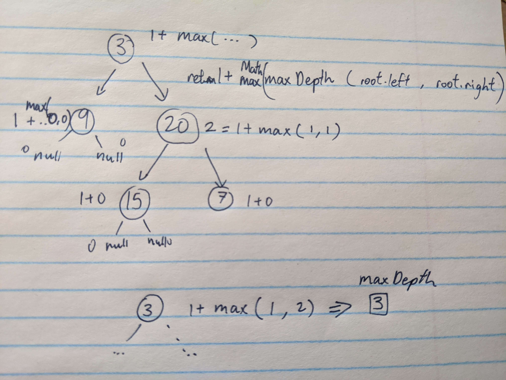

# Binary Trees

A [binary tree](https://emre.me/data-structures/binary-tree/) is a tree-like data structure where each node has at MOST 2 children, the left and right child.

A binary tree is either empty or a root node ```r``` together with a left binary tree and a right binary tree. The subtrees themselves are binary trees.


A binary search tree (BST) is where the left child node <= parent node < right child node. All the nodes follow this condition.

Traversals can be implemented in three ways:

1. Inorder - Left, Root, Right
2. Preorder - Root, Left, Right
3. Postorder - Left, Right, Root

As per the diagram the traversals should be as follows

* Inorder: 17, 241, 0, 8, 429, 11, 3, 320, 2, 401, 616, 1, 257, 2, 8, 241, 17
* Preorder: 320, 8, 241, 17, 0, 429, 3, 11, 8, 2, 1, 401, 616, 257, 241, 17
* Postorder: 17, 0, 241, 11, 3, 429, 8, 616, 401, 257, 1, 2, 17, 241, 8, 320

## Easy Problems

### 1. Maximum Depth of Binary Tree

>Given a binary tree, find its maximum depth.
</br>The maximum depth is the number of nodes along the longest path from the root node down to the farthest leaf node.
</br>Note: A leaf is a node with no children.

We use a recursive function that searches for the maximum depth of the tree by traversing through the maximum depth of left subtree and right subtree. The function continues to traverse the tree until it reaches a null at which it returns 0 because theres no more modes at the depth. 



```javascript
const maxDepth = (root) => {
    if (root === null) {
        return 0;
    }
    return 1 + Math.max(maxDepth(root.left), maxDepth(root.right));  
};
```

### 2. Validate Binary Search Tree

>Given a binary tree, determine if it is a valid binary search tree (BST).</br></br>
Assume a BST is defined as follows:</br>
The left subtree of a node contains only nodes with keys less than the node's key.</br>
The right subtree of a node contains only nodes with keys greater than the node's key.</br>
Both the left and right subtrees must also be binary search trees.

Assumption is that there are no duplicate key values. Because if there were, then the conditions stated above cannot be true when comparing the two same values.

#### Approach: Inorder traversal

First you push all your left side nodes into the stack. As you pop the left nodes, you compare the  

```javascript
 const isValidBST = (root) => {
   if (root === null) return true;
   let stack = [];
   let pre = null;
     
   while (root || stack.length) {
      while (root) {
         stack.push(root);
         root = root.left;
      }
      root = stack.pop();
      if(pre !== null && root.val <= pre.val) return false;
      pre = root;
      root = root.right;
   }
   return true;
};
```


## Medium Problems