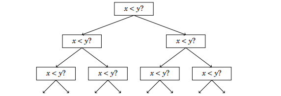
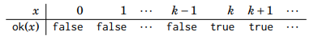

# Sorting Algorithms

Sorting is a fundamental algorithm design problems. Many efficient algorithms use sorting as a subroutine because it means much easier to process data if the element are sorted.

ex) "Does the array contain two equal elements?" becomes trivial if the elements become sorted.

The below shoes the time complexities of various sorting algorithms and the best is limited to ```O(nlog(n))``` time.

## Array Sorting Algorithms Complexity*

| Name                  | Best            | Average             | Worst               | Memory    | Stable    | Comments  |
| --------------------- | :-------------: | :-----------------: | :-----------------: | :-------: | :-------: | :-------- |
| **Bubble sort**       | n               | n<sup>2</sup>       | n<sup>2</sup>       | 1         | Yes       |           |
| **Insertion sort**    | n               | n<sup>2</sup>       | n<sup>2</sup>       | 1         | Yes       |           |
| **Selection sort**    | n<sup>2</sup>   | n<sup>2</sup>       | n<sup>2</sup>       | 1         | No        |           |
| **Heap sort**         | n&nbsp;log(n)   | n&nbsp;log(n)       | n&nbsp;log(n)       | 1         | No        |           |
| **Merge sort**        | n&nbsp;log(n)   | n&nbsp;log(n)       | n&nbsp;log(n)       | n         | Yes       |           |
| **Quick sort**        | n&nbsp;log(n)   | n&nbsp;log(n)       | n<sup>2</sup>       | log(n)    | No        | Quicksort is usually done in-place with O(log(n)) stack space |
| **Shell sort**        | n&nbsp;log(n)   | depends on gap sequence   | n&nbsp;(log(n))<sup>2</sup>  | 1         | No         |           |
| **Counting sort**     | n + r           | n + r               | n + r               | n + r     | Yes       | r - biggest number in array |
| **Radix sort**        | n * k           | n * k               | n * k               | n + k     | Yes       | k - length of longest key |

## O(n<sup>2</sup>) Algorithms

Usually such algorithms contain two nested loops. Such algorithms are Bubble Sort, Insertion Sort, Selection Sort. 

### Bubble Sort

Bubble has <em>n</em> rounds where the inner nested loop compares the current value with the next and swaps them if they are not in the correct order. The inner nested loop is to <em>n-1</em> because the it checks the value at <em>j+1</em> index

```javascript
//const array = [...numbers];

for (let i = 0; i < n; i++) {
    for (let j = 0; j < n - 1; j++) {
        if (array[j] > array[j+1]) {
            let temp = array[j];
            array[j] =  array[j+1];
            array[j+1] = temp;
        }
    }
}
```

#### Inversions

Inversions are a pair of array elements ```(array[i], array[j])``` where the conditions are true:

1. ```i < j```
2. ```array[i] > array[j]```

The number of inversions show how much work is done. If the array is sorted then no work is needed. If the whole array is reversely sorted then the number of inverions needed is O(n<sup>2</sup>). Each swap can remove only one inversion at a time hence O(n<sup>2</sup>) time complexity.


### Insertion Sort


### Selection Sort


## O(n&nbsp;log(n)) Algorithms

Faster sorting methods in <em>n&nbsp;log(n)</em> time includes Heap Sort, Merge Sort, Quick Sort.

### Merge Sort

Merge sort is based on recursion and sorts the ```array[a..b]``` as follows:

1. ```a = b``` Do not do anything because the array is sorted
2. Calculate the position of the middle element ```k = (a + b) / 2```
3. Recursively sort the subarray ```array[a...k]``` & ```array[k + 1...b]```
4. Merge the sorted subarrays into a sorted array ```array[a...b]```

Recursion consists of ```O(logn)``` levels and halves the size of the subarray at each step.

#### Sorting Lower Bound

It is not possible to sort an array faster than in ```O(nlogn)``` time. 



*<sub>Referenced by competitive programmer's handbook</sub>

#### Counting sort

The lower bound *nlogn* does not pertain to sorting algorithms that does not compare the value. One such algorithm is *counting sort* which sorts an array in ```O(n)``` time assuming that every element in the array is an int from ```0 to c``` and ```c = O(n)```

You can use a bookkeeping array that counts how many times an integer apppears in the array. It takes ```O(n)``` time to create the bookkeeping array and ```O(n)``` time to create the sorted array. However, counting sort can only be used when the constant ```c``` is small enough so that array element can be used as indices in bookkeeping array.

## Binary Search

To find a element in an array, a simple loop would do it in ```O(n)``` time. However there is a faster method to do it in ```O(logn)``` time if the array is already sorted.

```javascript
function binarySearch(array, target) {
    let a = 0;
    let b = array.length - 1;
    
    while (a <= b) {
        let k = Math.floor((a + b) / 2);
        if (array[k] === target) {
            return k;
        }
        if (array[k] > target) b = k - 1;
        else a = k + 1;
    }
    return -1;
};
```

An alternative and more efficient method is based on iterating through the array. We make jumps and slow the speed as we get closer to the target element. The jump lengths will be halved at each iteration: ```n/2```, ```n/4```, ```n/8``` & etc.

We start initially at the index 0 and compare:

1. If the current index + jump length is within array length AND
2. If the value at the current index + jump length is smaller than our target
   1. Since this is a sorted array, if the value at the index is greater, it means our jump is too much.
   2. We need to halve our jump length and try again

The loop exits either when we reach the condition where the ```b = 0```. The while loop may not run because either

1. The target does not exist in the array so we return ```-1```. OR
2. The target is found so nothing is needed to be done. We return ```k```.

```javascript
function binarySearch2(array, target) {
    let k = 0;

    for (let b = Math.floor(array.length/2); b >= 1; b = Math.floor(b/2)) {
        while (k + b < array.length && array[k + b] <= target) k += b;
    }
    if (array[k] === target) return k;
    else return -1; 
};
```

### Finding the smallest solution

An important use of binary search is to find the position ```x``` when a function changes. We can use binary search to find the smallest valid solution that satifies an function ```ok(x)```.

```ok(x)``` returns ```true``` if ```x``` is a valid solution and ```false``` otherwise. It is ```false``` when ```x < k``` && ```x >= k```.



*<sub>Referenced from Competitive Programming handbook</sub>

```javascript
let x = -1;
for (let b = z; b >= 1; b = Math.floor(b / 2)) {
    while (!ok(x + b)) x += b;
}
return k = x + 1;
```

### Finding the maximum value

Same thing applies as the smallest solution but instead we make sure our ```next``` value is greater than our ```current``` value. Here the function ```f(x)``` is first increasing then decreasing. This is similar to finding the maximum of a function.

```javascript
let x = -1;
for (let b = z; b >= 1; b = Math.floor(b / 2)) {
    while (f(x + b) < f(x + b + 1)) x += b;
}
return k = x + 1;
}
```

